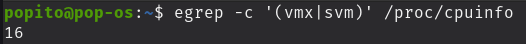
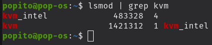
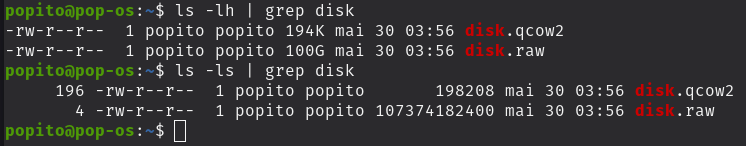
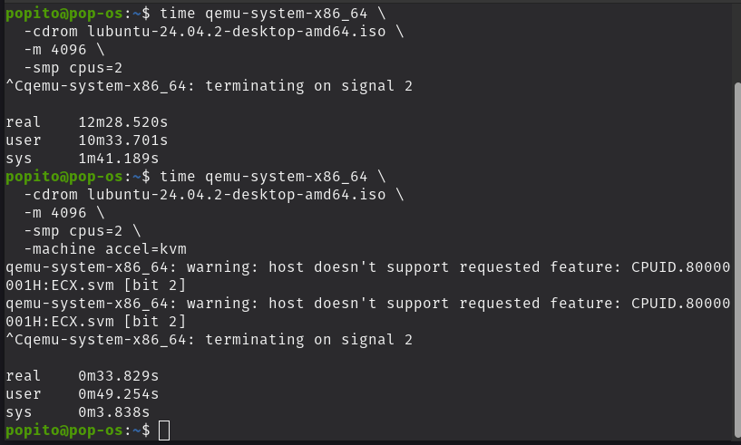
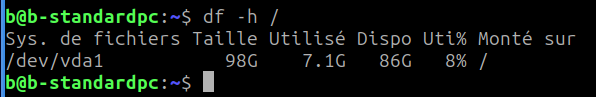
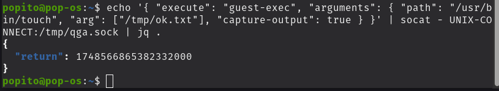
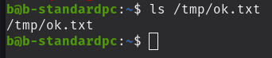
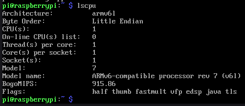

# QEMU Virtualization Lab


[](LICENSE)

Hands-on exploration of **QEMU/KVM** and system emulation:  
benchmarking, VirtIO optimisation, QEMU Guest Agent integration, ARM (Raspberry Pi) emulation, and a one-command automation script.

---

## Repository layout

```
qemu-virtualization-lab
├─ docs/            # PDF report
├─ src/             # Bash automation script
└─ screenshots/     # Key proof-of-work images
```

| Folder | Highlight |
|--------|-----------|
| **docs/** | ➜ `Introduction_to_QEMU.pdf` – full illustrated report |
| **src/** | ➜ `vm_run.sh` – launches a KVM VM with VirtIO, Guest Agent, port-forwarding |
| **screenshots/** | 9 curated PNGs referenced below & in the PDF |

---

## Quick start

```bash
# Launch a Lubuntu VM with 2 vCPU, 4 GB RAM, VirtIO disk/net,
# Guest Agent socket and host port 4000 → guest 22 (SSH)
bash src/vm_run.sh -d lubuntu.qcow2 -i lubuntu-24.04.2-desktop-amd64.iso
```

---

## Key results at a glance

| Proof | Screenshot |
|-------|------------|
| **KVM enabled** (vmx/svm = 16 flags) |  |
| **KVM modules loaded** |  |
| **Raw vs qcow2 size** |  |
| **Boot time: full emu → KVM (12 min ➜ 33 s)** |  |
| **VirtIO switch (`/dev/sda` ➜ `/dev/vda`)** |  |
| **Guest Agent file creation** |  |
| **Guest confirms file** |  |
| **ARM (Raspberry Pi) emulation** |  |

---

## Full report 📄

Read the detailed lab document (methodology, metrics, conclusions):

**[docs/Introduction_to_QEMU.pdf](docs/Introduction_to_QEMU.pdf)**  

---

## Why it matters

* **Performance engineering** – showed a ×10 boot-time gain from KVM and ×2 from VirtIO.  
* **Cross-architecture testing** – ran an ARMv6 guest entirely in software.  
* **Automation** – one Bash script to reproduce the whole setup.  
* **Host–guest orchestration** – leveraged QEMU Guest Agent for real-time operations.

---

## License

Code and documentation licensed under the **MIT License** – free to use, share and adapt.
